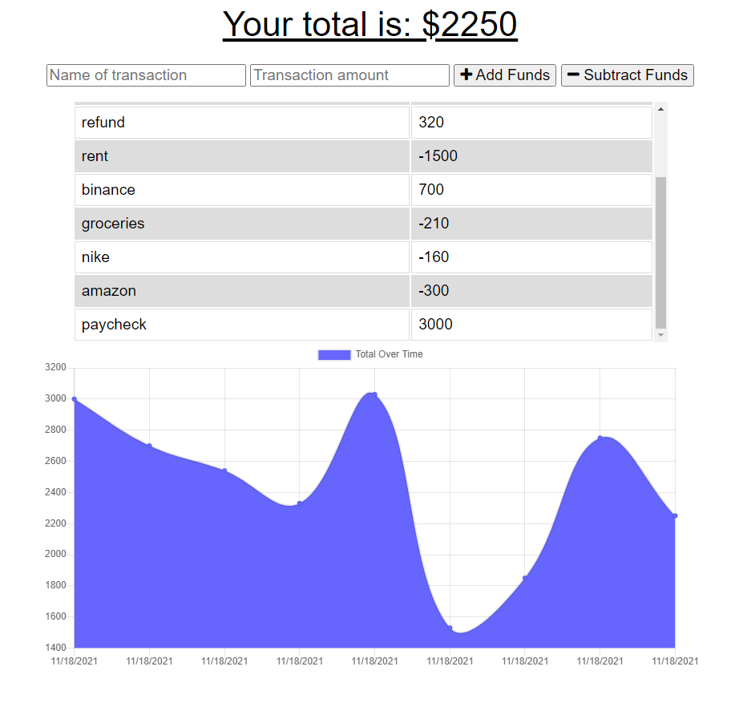

# Progressive Budget
  

  ## Description:
This is a budget tracking system that allows the user to add expenses and deposits to thier budget. Through a line graph, the app displays the user's transactions as their budget is spent and added to it.

The application uses Express.JS for establishing API routes and uses MongoDB as it's database.

## Deployed Application:

  
  ## Table of Contents 
  
  * [Installation](#installation)
  
  * [Screenshot](#screenshot)
  
 * [License](#license)
  
  * [Questions](#questions)
  
  ## Installation:
  To install all dependencies, run the following:

  `
  npm install
  `
  ## Screenshot:

  

  ## License:
  

    This repository is licensed under the MIT license 

  ## Questions:
  Questions about this repository? Please contact me at [mohamed.lazrekb@gmail.com](mailto:mohamed.lazrekb@gmail.com). View more of my work in GitHub at [Lazrekm](https://github.com/lazrekm) 
  